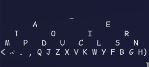
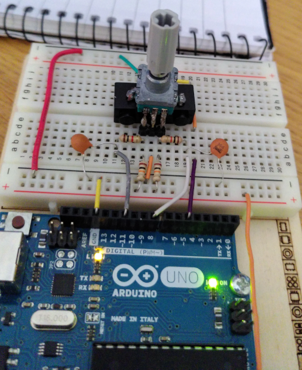

# rotary-kb
A minimal keyboard consisting only of a rotary encoder with a button

The treeboard:  
Currently selected key is highlighted with a `)`

The finished circuit:  

I sacrificed one Lego piece to make it fit on, now I can attach a Lego wheel to it.  
Since pressing the button takes a bit too much force, there is also a Lego 3x1 brick under the encoder which supports it so that the pins don't take all the load.
