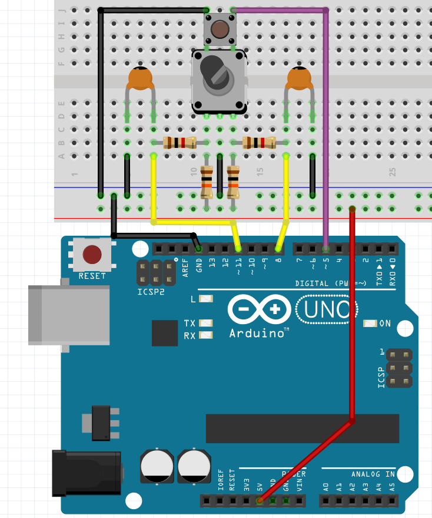

# Hardware

## Components:
- Arduino UNO
- rotary encode with button (for example EC11B152442D)
	- or rotary encoder and separate button
- 2x 100nF capacitors (ceramic type 104)
- 2x 1K resistors
- 2x 10K resistors

## Schematic:

